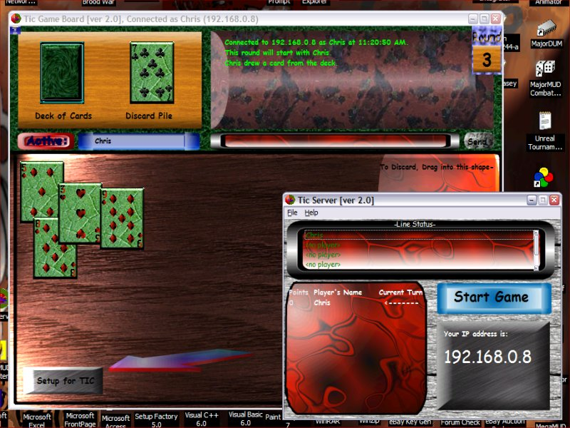



## Multiplayer Card Game Called Tic

### Description

(I have put this description in the zip, so if you want nicley formated description, download the project.)

Happy new year! I have been working on this project for a long time, about 4/5 months or so. This program is of a card game called Tic. The game is similar to rummy, but is still quite different. Full rules of the game are included in the program. Also, this is a multiplayer program that uses Winsock.

In the zip, there are 2 projects, the server and the game board.

Includeds:

-Transparent Textboxes

-Transparent Listboxes

-Really nice graphics (See screenshot)

-Lots of good code

-Nice pictures of all the cards.

I have also written a help file for the program. You can read the help file for instructions on how to set it up, and get a game going. The server can support upto 5 players. The game usually uses 2 52 card decks to play, but i have added an option to change that amount from anywhere between 2 and 5.

Once players are connected, and the person who is controlling the server chooses to start the game, the server shuffles up all the cards, and sends out hands to the players.

The server keeps track of the round, cards in the deck, cards that have been played, the discard pile, and the points the players have earned.

To run this program, you must have a minimum of 800x600 resolution, and must have Internet Explorer (5?) (not sure what version you need) because the program uses the webbrowser control to view the help file.

To do the transparent controls i used subclassing (and i got a bit messy with it, but it works). The after effect of all that is a nice looking program.

On the Game Board project, i decieded to make my own menu, so i used a combonation of picture boxes and labels, and it cam out really nice.

One more thing...

As in a real game of cards, players sometimes cheat. Well, i have added in a secret command(well not so secret anymore) that allows players to cheat if they really really want to. The cheating goes undetected by other players.

All the code is commented where it needs to be commented.

This has gone through about 1 and a half months of beta testings, so it should be pretty bug free. If you find any bugs with it, leave a comment here, or email be at theendorbunker@attbi.com.

Please leave comments here on what you think about this, or email me your thoughts at theendorbunker@attbi.com. Thanks.

If you like this code, place a vote on it.

Visit the offical site at: http://www.geocities.com/thrice_twice/index.html

Thanks for looking!
 
### More Info
 

             |
---                |---
**Submitted On**   |2002-01-02 10:45:44
**By**             |[Chris Van Hooser](https://github.com/Planet-Source-Code/PSCIndex/blob/master/ByAuthor/chris-van-hooser.md)
**Level**          |Intermediate
**User Rating**    |5.0 (20 globes from 4 users)
**Compatibility**  |VB 6\.0
**Category**       |[Games](https://github.com/Planet-Source-Code/PSCIndex/blob/master/ByCategory/games__1-38.md)
**World**          |[Visual Basic](https://github.com/Planet-Source-Code/PSCIndex/blob/master/ByWorld/visual-basic.md)
**Archive File**   |[Multiplaye46291142002\.zip](https://github.com/Planet-Source-Code/chris-van-hooser-multiplayer-card-game-called-tic__1-30396/archive/master.zip)

